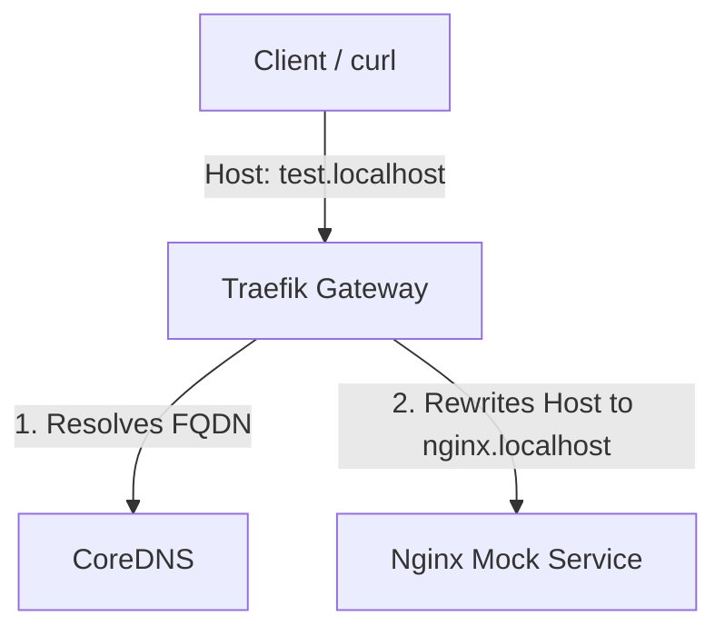

# Kubernetes Gateway API FQDN Forwarding PoC

This repository contains a proof-of-concept (PoC) to test the Kubernetes Gateway API forwarding traffic to an external service using an FQDN-based `EndpointSlice`. It is designed to run in a local `k3d` cluster with Traefik as the Gateway API provider.

## Context & Architecture



1. **Local Kubernetes Cluster**: `k3d` with Traefik acting as the Gateway API provider.
2. **Gateway Listener**: Listens on the domain `test.localhost`.
3. **Mock External Service**: Running in the `external-target` namespace, mimicking an external service. It strictly validates the incoming `Host` header. If the `Host` header is not `nginx.localhost`, it returns a `404` error.
4. **Core Goal**: Routing traffic from `test.localhost` via Gateway API to an FQDN destination (`nginx-external-svc.external-target.svc.cluster.local`) while using the `RequestHeaderModifier` filter to rewrite the `Host` header to `nginx.localhost` so the mock service returns a `200 OK`.

---

## File Map

- **[01-mock-external.yaml](file:///mnt/data/manhp/k8s-forwarding/01-mock-external.yaml)**: Mock external service, custom Nginx ConfigMap, Deployment, and Service.
- **[02-gateway-routing.yaml](file:///mnt/data/manhp/k8s-forwarding/02-gateway-routing.yaml)**: Headless Service, FQDN-based `EndpointSlice`, `GatewayClass`, `Gateway`, and `HTTPRoute` with host rewriting filter.
- **[03-test-commands.sh](file:///mnt/data/manhp/k8s-forwarding/03-test-commands.sh)**: Automates the cluster creation, Gateway API CRD installation, Traefik deployment, manifest application, and verification tests.

---

## Quick Start / Setup

Run the automated script to provision the cluster, deploy the components, and run the test cases:

```bash
chmod +x 03-test-commands.sh
./03-test-commands.sh
```

### Manual Verification

Once resources are ready, you can manually run the following tests:

1. **Verify routing via Gateway:**
   ```bash
   curl -i -H "Host: test.localhost" http://localhost:80/
   # Expected: 200 OK with message "Hello from External Nginx"
   ```

2. **Verify target service host validation (direct query failing):**
   ```bash
   kubectl run curl-test-404 --rm -i --tty --image=curlimages/curl --namespace=demo --restart=Never -- \
     curl -i -H "Host: test.localhost" http://nginx-external-svc.external-target.svc.cluster.local/
   # Expected: 404 Not Found - Host header mismatch
   ```

3. **Verify target service host validation (direct query succeeding):**
   ```bash
   kubectl run curl-test-200 --rm -i --tty --image=curlimages/curl --namespace=demo --restart=Never -- \
     curl -i -H "Host: nginx.localhost" http://nginx-external-svc.external-target.svc.cluster.local/
   # Expected: 200 OK
   ```
